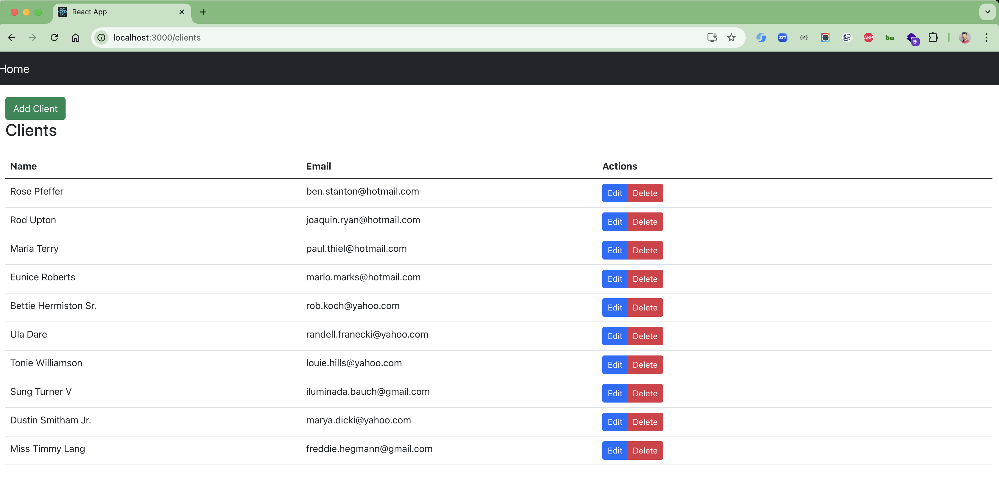
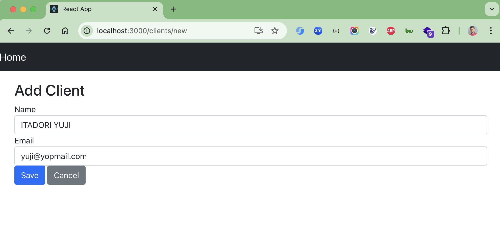
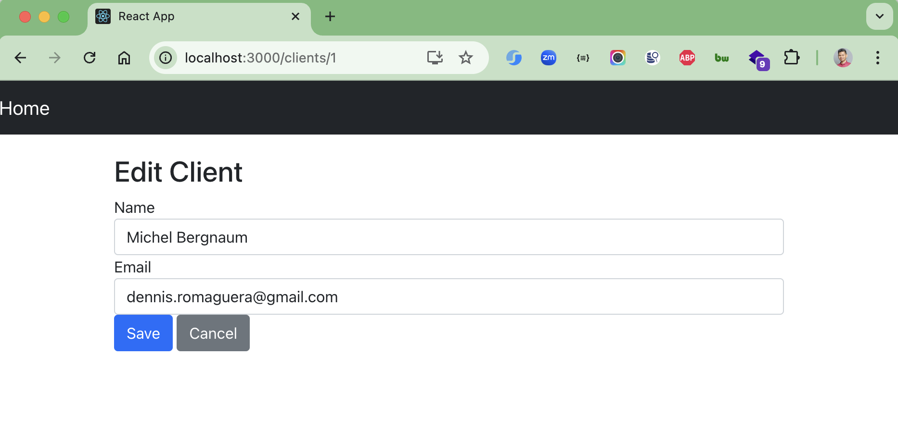

# spring-boot-react

### Things todo list:

1. Clone this repository by running `git clone https://github.com/hendisantika/spring-boot-react.git`
2. Navigate to the directory `cd spring-boot-react`
3. Run `mvn clean spring-boot:run` to build and run the application
4. Navigate to the directory `cd react-app`
5. Run `pnpm install` to install all dependencies
6. Open your favorite browser and hit `http://localhost:3000`
7. Enjoy!!!

### Screenshot

Client List Page

Add Client Page

Edit Client Page

